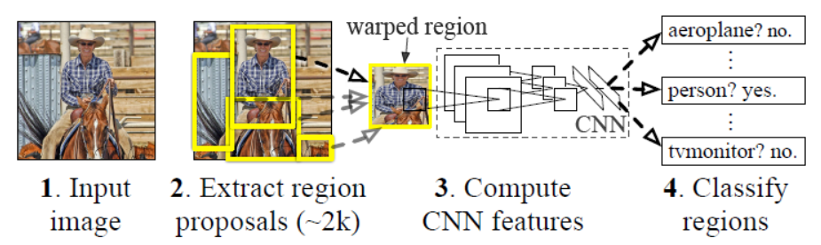
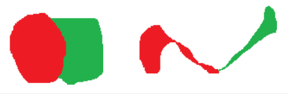
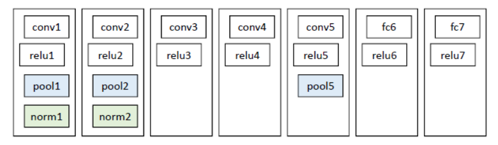

## R-CNN Notes

## pre-requisite
- [bounding box regression]()
- [hard negative mining]()

### 解决的问题
#### 1. 速度
经典目标检测算法使用 __滑动窗口__ 依次判断所有可能的区域，是一种穷举的方法，在速度上非常慢

RCNN则使用了预先提取的可能区域，之后在这些区域上提取特征进行判断

#### 2. 训练集问题
经典目标检测算法在区域中提取人工设定的特征(Haar, HOG)等，RCNN则使用深度网络进行特征提取，在Imagenet上预训练，在目标检测上调优

### 算法流程
- 对一张图像生成 1K ~ 2K 的候选区域
- 对每一个候选区域，使用CNN提取特征
- 特征送入 __每一类__ 的SVM分类器，判别是否属于该类
- 使用回归器精细修正候选框的位置

### 算法细节
#### 1. 生成候选区域
使用了`Selective Search`的方法从一张图像中生成2k~3k个区域，基本的思路如下
- 使用 __过分割__ 的手段，将图像分割成小区域
- 查看现有小区域，合并 __可能性最高__ 的两个区域，重复直到整张图像合并成一个区域
- 输出 __所有曾经存在过的区域__ ，即所谓的候选区域

合并规则:
- 颜色相近
- 纹理相近
- 合并后总面积小
- 合并后总面积在其BBOX中所占比例大
- 保证合并操作的尺度较为均匀
  - 对于区域 a-b-c-d-e-f-g-h, 较好的合并方式是 ab-cd-ef-gh -> abcd-efgh -> abcdefgh
  - 对于区域 a-b-c-d-e-f-g-h, 不好的合并方式是 abcd-e-f-g-h -> abcdef-g-h -> abcdefgh
- 合并后尽量保证形状, 如下所示: 左图更加适合合并

- 为了尽可能不遗漏候选区域, 上述操作在多种颜色空间中进行, (RGB, HSV, Lab等), 在同一个颜色空间中使用上述四条规则的不同组合进行合并，最后去重输出

#### 2. 特征提取
使用CNN提取特征之前, 先把候选区域归一化成同一个尺寸(227, 227)

#### 3. 预训练
网络结构如下:

最后一层为`4096->1000`的fc层，使用Imagenet2012进行训练

#### 4. 调优训练
网络结构相同，但是最后一层更换为`4096->21`, 输入一张图片, 输出21个类别信号, 分别表示20个类别以及背景类, 考虑一个候选框和当前图像上所有标定框重叠面积最大的一个, 如果重叠比例大于0.5, 则认为此候选框为此标定的类别，否则则为背景类

训练数据使用`PASCAL VOC 2007`的训练集

#### 5. 类别判断
与第四点不同，这个是在测试集上进行的，第四点中的调优训练是针对目标检测训练集的fine-tune, 第五点所描述的是测试流程

分类器
对于每一个目标，使用`SVM`二类分类器判断，输入为CNN输出的4096特征向量，输出是否属于此类
由于负样本很多，故使用`hard negative mining`的方法进行训练

#### 6. 位置精修
使用`边框回归`进行精修

回归器:
对于每一类目标，使用线性回归器精修，输入为4096维特征向量，输出为xy方向的缩放和平移

训练样本:
判定为本类的边框中，和真实值重叠面积大于0.6的候选框

## Reference
- [【目标检测】RCNN算法详解](https://blog.csdn.net/shenxiaolu1984/article/details/51066975)