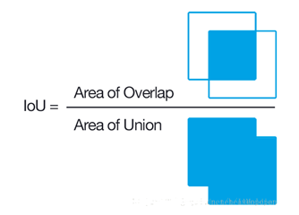
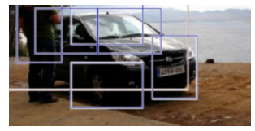
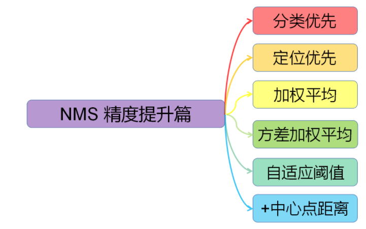

## Non Maximum Suppression

### 1. IoU

AB重叠的面积占AB并集面积的比例

计算流程如下:
- 首先计算两个box左上角点坐标的最大值, 和右下角点坐标的最小值
- 计算交集面积
- 最后把交集面积除以对应的并集面积

code:
- [IoU.py]()

### 2. Traditional NMS
NMS用于合并最后的候选框

假设在目标检测中定位到了一个车辆，利用算法找到了一堆候选方框，我们需要判别哪些矩形方框是没有意义的

假定存在6个候选框，首先根据 __分类器的分类概率__ 进行排序，假设从小到大属于车辆的概率分别为 A-B-C-D-E-F
- 从最大概率的矩形框F开始,先将F添加到输出列表中, 并将其从候选框列表中删除, 依次判定A~E与F的重叠度(IoU)是否大于某个设定的阈值, 如果大于某个阈值的话, 表明这两个候选框很可能检测到同一个类别的物体
- 假设B和D与F的重叠度超过阈值, 那么就在候选框列表中删除B和D
- 从剩下的矩形框A,C,E中，选择概率最大的E, 加入输出列表中, 然后判断E与A和C的IoU, 如果大于一定的阈值, 就从候选框列表中删除, 并标记E为保留下来的第二个矩形框
- 重复上述过程, 直到候选框列表为空, 返回输出列表

Details:
- 输入的是所有的候选框, 候选框包括所框定的位置, 以及框定区域所属的类别, NMS可以帮助去重

## NMS Development

### 1. 分类优先
#### a. Traditional NMS (2017)
- Disadvantage:
  - 按顺序剔除, 需要逐一计算IoU, 计算效率下降
  - 剔除机制太严格, 根据NMS阈值暴力剔除, 如果有真实物体在重叠区域出现, 则将被剔除, 导致检测失败, 从而降低算法的平均检测率
  - 阈值是根据经验选取的, 没有特定标准, 设置过小容易误删, 设置过大的话又容易增大错检
  - 评判标准仅仅为IoU, 只考虑两个框之间的重叠面积, 这对于描述bounding box之间的关系不够全面
  - 一般只能用CPU计算, 但是cuda好像开发了NMS core, 所以这个问题也得到了解决

#### b. Soft-NMS (ICCV 2017)
由于传统NMS算法过于粗暴, 直接删除所有IoU大于阈值的框, 因此soft-NMS吸取了NMS的教训, 在算法执行的过程中不是简单的对IoU大于阈值的检测框删除, 而是降低得分.

算法流程和NMS相同, 对于原置信度得分使用函数运算, 目标是降低得分(传统NMS是直接将置信度得分降为0并剔除), 最后再通过设置阈值(BTW, 这个阈值是手动设置的, 也有提升空间), 将得分较低的检测框去除

Code:
- [NMS.py](https://github.com/rentainhe/mini-detection/blob/master/core/NMS.py)

## Reference
- [NMS算法详解(附Pytorch代码实现)](https://zhuanlan.zhihu.com/p/54709759)
- [非极大值抑制(Non-Maximum Suppression)](https://www.cnblogs.com/makefile/p/nms.html)
- [一文打尽目标检测NMS——精度提升篇](https://zhuanlan.zhihu.com/p/151914931)
- [NMS, soft-nms, softer-nms](https://zhuanlan.zhihu.com/p/89426063)
- [Soft-NMS](https://zhuanlan.zhihu.com/p/41046620)